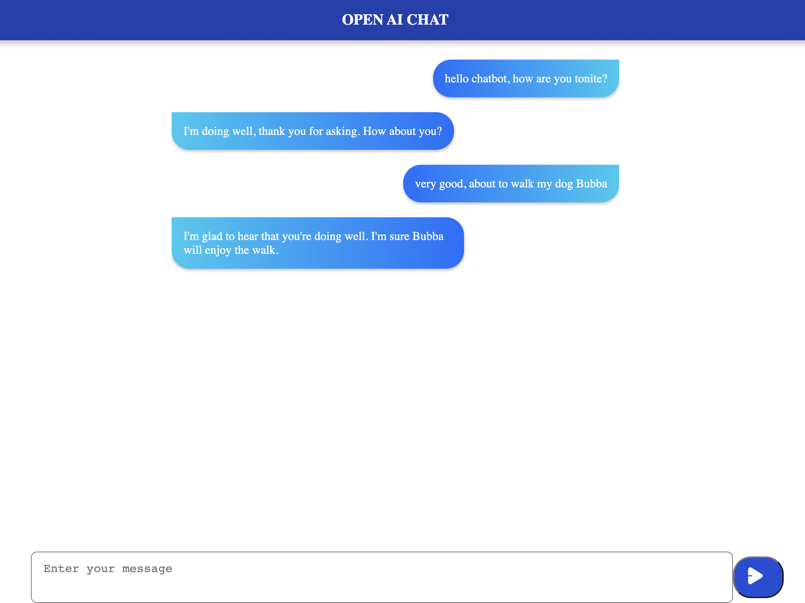

## OpenAI Chat App
This is a chat app that is built with Next.js, the [OpenAI API](https://platform.openai.com/), styled components, and Netlify Functions. The app uses the OpenAI API to generate responses to user messages in the chat window. The app is [deployed on Netlify here](https://openaichat-bydavid.netlify.app/).

## How to Use
To use the app, simply type a message into the text input field and press the send button. The OpenAI API will generate a response to your message and display it in the chat window. You can continue the conversation by typing additional messages and the OpenAI API will respond accordingly.